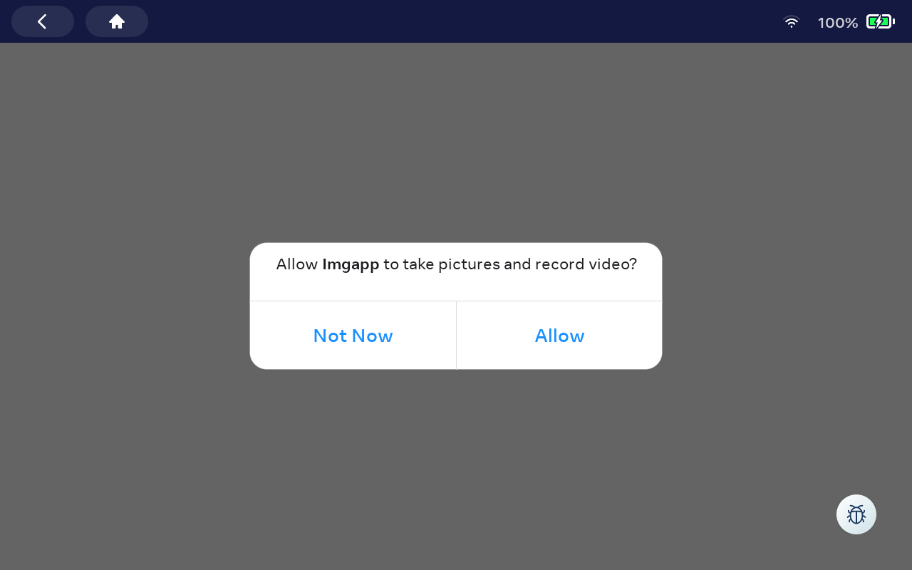
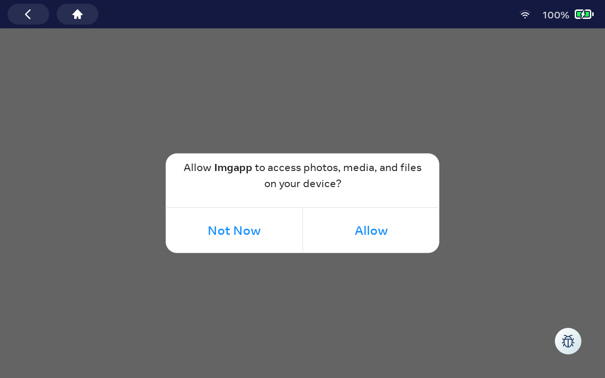

# imgapp

imgapp is a tool to test image encoding in Android. It is basically a wrap on [`android.graphics.Bitmap`](https://developer.android.com/reference/android/graphics/Bitmap) and [`android.graphics.BitmapFactory`](https://developer.android.com/reference/android/graphics/BitmapFactory).


# 1. Prerequisites

For running imgapp:
* adb connection to the device being tested.
* ffmpeg with decoding support for the codecs to be tested


## 2.1. set up the android SDK and NDK in the `local.properties` file.

Create a `local.properties` file with valid entries for the `ndk.dir` and
`sdk.dir` variables.

```
$ cat local.properties
ndk.dir: /opt/android_ndk/android-ndk-r19/
sdk.dir: /opt/android_sdk/
```

Note that this file should not be added to the repo.


## 2.2. build the imgapp app

```
$ ./gradlew clean
$ ./gradlew build
...
BUILD SUCCESSFUL in 11s
83 actionable tasks: 81 executed, 2 up-to-date
```


## 2.3. install the imgapp app

```
$ ./gradlew installDebug
```

You can check that the app was installed correctly:
```
$ adb shell cmd package list package |grep imgapp
package:com.facebook.imgapp
```

You can also remove the app:
```
$ adb uninstall com.facebook.imgapp
```

## 2.4. run a quick image decoding experiment with the app

Prepare the encoded image.
```
$ adb push media/green.heic /sdcard/
```

Run a simple experiment encoding the image.
```
$ adb shell am start -W  -e decode a -e input /sdcard/green.heic -e output /sdcard/green.rgba com.facebook.imgapp/.MainActivity
Starting: Intent { act=android.intent.action.MAIN cat=[android.intent.category.LAUNCHER] cmp=com.facebook.imgapp/.MainActivity (has extras) }
Status: ok
LaunchState: COLD
Activity: com.facebook.imgapp/.MainActivity
TotalTime: 470
WaitTime: 471
Complete
```

Note that, for the very first time you run the instrumentation codecs, the device will ask you for permission to access to `/sdcard/`.

Figure 1 shows imgapp in an android device asking for permission to access to the camera.




Figure 2 shows imgapp in an android device asking for permission to access to /sdcard/.



You may need to rerun the experiment after granting the permissions.

Check the results.
```
$ adb shell ls -Flasgtr /sdcard/
...
    16 -rw-rw----  1 sdcard_rw      9144 2023-08-30 14:55 green.heic
 47628 -rw-rw----  1 sdcard_rw  48771072 2023-08-30 15:22 green.rgba
```

Get the output (raw) file from the device and make it viewable.
```
$ adb pull /sdcard/green.rgba /tmp/
$ ffmpeg -y -f rawvideo -video_size 3024x4032  -pix_fmt rgba -i /tmp/green.rgba /tmp/green.png
```

Now you should be able to open the /tmp/green.png image.
